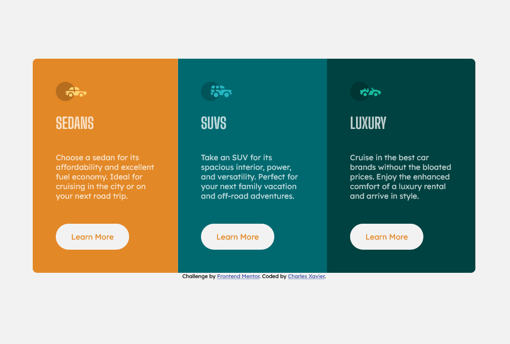

# Frontend Mentor - 3-column preview card component solution

This is a solution to the [3-column preview card component challenge on Frontend Mentor](https://www.frontendmentor.io/challenges/3column-preview-card-component-pH92eAR2-). Frontend Mentor challenges help you improve your coding skills by building realistic projects.

## Table of contents

- [Overview](#overview)
  - [The challenge](#the-challenge)
  - [Screenshot](#screenshot)
  - [Links](#links)
- [My process](#my-process)
  - [Built with](#built-with)
  - [What I learned](#what-i-learned)
  - [Continued development](#continued-development)
  - [Useful resources](#useful-resources)
- [Author](#author)
- [Acknowledgments](#acknowledgments)

**Note: Delete this note and update the table of contents based on what sections you keep.**

## Overview

### The challenge

Users should be able to:

- View the optimal layout depending on their device's screen size
- See hover states for interactive elements

### Screenshot

### Links

- Solution URL: [Add solution URL here](https://github.com/xav03tv/3-column-preview-card-component-main)
- Live Site URL: [Add live site URL here](https://3-column-preview-card-component-main-xav03tv.vercel.app/)

## My process

This is my first Frontent Mentor project.

I started by making the structure in HTML and then applied the desktop style. I added the mobile style afterwards.

I decided not to enlarge more than 3 cards on a big screen. Having a 4k screen, it looks good like this.

I could have added different break point to better adapt the design to each type of screen. But I'm in a hurry to do other projects :-p

(sorry for my english ... )

Translated with www.DeepL.com/Translator (free version)

### Built with

- Semantic HTML5 markup
- CSS custom properties
- Flexbox
- SCSS

### What I learned

In this first project I mainly learned to use GIT, VERCEL.

## Author

- Frontend Mentor - [@yourusername](https://www.frontendmentor.io/profile/xav03tv)
